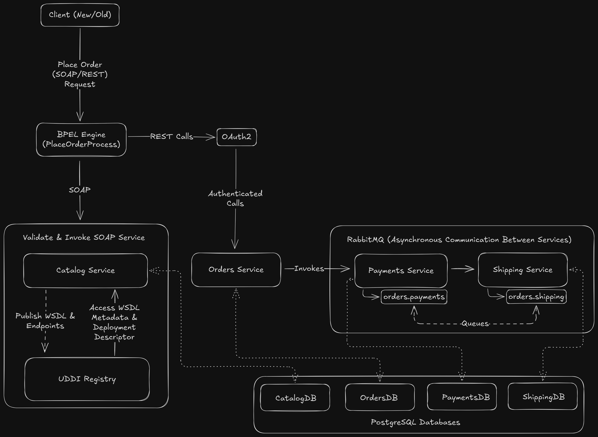

# GlobalBooks Inc. SOA & Microservices Project

This project demonstrates a **Hybrid Service-Oriented Architecture (SOA)** for GlobalBooks Inc., combining traditional SOAP services with modern REST microservices. It showcases the coexistence of different service protocols within the same ecosystem, integrated through asynchronous messaging and BPEL orchestration.

## Project Overview

The system is designed to process orders, leveraging:
-   A **SOAP CatalogService** for legacy partner integrations.
-   **REST Microservices** (`OrdersService`, `PaymentsService`, `ShippingService`) for scalable, independent functionalities.
-   **RabbitMQ** as an Enterprise Service Bus (ESB) for asynchronous communication.
-   **Apache ODE** for BPEL orchestration of complex workflows.

## Architecture Diagram



## Technology Stack

-   **Java:**
    -   **JDK 8:** For the SOAP `catalog-service` (due to `wsimport` requirements).
    -   **OpenJDK 18:** For all REST microservices.
-   **SOAP Framework:** JAX-WS (Contract-First)
-   **REST Framework:** Spring Boot 3.x
-   **Application Server:** Apache Tomcat 9.x (for SOAP WAR deployment)
-   **Database:** PostgreSQL 17.5
-   **Message Broker:** RabbitMQ ESB
-   **BPEL Engine:** Apache ODE
-   **Testing:** SOAP UI, Postman
-   **Security:** WS-Security (SOAP), Spring Security OAuth2 (REST)
-   **IaC (Future):** OpenTofu
-   **CI/CD (Future):** GitHub Actions

## Local Development Setup Instructions

Follow these steps to set up and run the entire project locally.

### 1. Prerequisites

Ensure the following software is installed on your system:

-   **Java Development Kit (JDK):**
    -   **JDK 8:** For building the `catalog-service`. Make a note of its installation path (e.g., `D:\SOFTWARES\Programing\Java\openjdk-8u462-b08`).
    -   **OpenJDK 18:** Set as your default `JAVA_HOME` for Spring Boot applications.
-   **Apache Maven:** Version 3.8+.
-   **PostgreSQL:** Version 17.5 (local installation).
-   **RabbitMQ Server:** Local installation or Docker. Ensure the management plugin is enabled.
-   **Apache Tomcat:** Version 10.x (local installation).
-   **Apache ODE BPEL Engine:** Local deployment.
-   **SOAP UI:** For testing SOAP services.
-   **Postman:** For testing REST APIs.
-   **`zip` utility:** (For BPEL packaging, if not using Python script).

### 2. Environment Configuration (`.env` file)

Create a `.env` file in the project root (`globalbooks-soa/`) with the following content. Adjust paths and credentials as per your local setup.

```dotenv
# Local Database
DB_HOST=localhost
DB_PORT=5432
DB_NAME_CATALOG=globalbooks_catalog
DB_NAME_ORDERS=globalbooks_orders
DB_NAME_PAYMENTS=globalbooks_payments
DB_NAME_SHIPPING=globalbooks_shipping
DB_USERNAME=postgres
DB_PASSWORD=secure_password

# Local RabbitMQ
RABBITMQ_HOST=localhost
RABBITMQ_PORT=5672
RABBITMQ_USERNAME=guest
RABBITMQ_PASSWORD=guest
RABBITMQ_MANAGEMENT_PORT=15672

# Local Service Ports
TOMCAT_PORT=8080
ORDERS_SERVICE_PORT=8081
PAYMENTS_SERVICE_PORT=8082
SHIPPING_SERVICE_PORT=8083
ODE_PORT=8084

# OAuth2 Configuration
OAUTH2_CLIENT_ID=globalbooks-client
OAUTH2_CLIENT_SECRET=your-secret-here
OAUTH2_TOKEN_URI=http://localhost:9000/oauth2/token

# Service URLs (Local)
CATALOG_SERVICE_URL=http://localhost:8080/catalog-service
ORDERS_SERVICE_URL=http://localhost:8081
PAYMENTS_SERVICE_URL=http://localhost:8082
SHIPPING_SERVICE_URL=http://localhost:8083
BPEL_SERVICE_URL=http://localhost:8084/ode
```

### 3. Database Setup

1.  **Install PostgreSQL:** If not already installed, follow the instructions in `local-setup/database/postgresql-setup.md`.
2.  **Create Databases:** Execute the SQL script to create the necessary databases:
    ```bash
    psql -U postgres -f local-setup/database/init-scripts/create-databases.sql
    ```
    (Replace `postgres` with your PostgreSQL superuser if different).

### 4. RabbitMQ Setup

1.  **Install RabbitMQ:** If not already installed, follow the instructions in `local-setup/rabbitmq/rabbitmq-setup.md`.
2.  **Start RabbitMQ:** Ensure the RabbitMQ server is running. If using Docker, you can use the provided `docker-compose.rabbitmq.yml`:
    ```bash
    cd local-setup/rabbitmq
    docker-compose -f docker-compose.rabbitmq.yml up -d
    ```
3.  **Configure Exchanges and Queues:** The Spring Boot applications will automatically declare the necessary exchanges and queues on startup. You can verify them via the RabbitMQ Management UI at `http://localhost:15672`.

### 5. Apache Tomcat Setup

1.  **Install Tomcat:** If not already installed, follow the instructions in `local-setup/tomcat/tomcat-setup.md`.
2.  **Configure Port:** Ensure Tomcat is configured to run on port `8080`.

### 6. Apache ODE Setup

1.  **Install Apache ODE:** If not already installed, follow the instructions in `local-setup/apache-ode/ode-setup.md`.
2.  **Configure Port:** Ensure Apache ODE is configured to run on port `8084`.

### 7. Build and Deploy Services

#### 7.1. Build and Deploy `catalog-service` (SOAP)

1.  **Set JDK 8 for `wsimport`:** Temporarily set your `JAVA_HOME` to your JDK 8 installation path or use the full path to `wsimport.exe`.
    ```bash
    # Example (Windows)
    set PATH=%PATH%;D:\SOFTWARES\Programing\Java\openjdk-8u462-b08\bin
    # Example (Linux/macOS)
    export PATH=$PATH:/path/to/openjdk-8u462-b08/bin
    ```
2.  **Clean and Install:**
    ```bash
    mvn -f services/catalog-service/pom.xml clean install
    ```
3.  **Deploy WAR:** Copy the generated `catalog-service-1.0.0.war` from `services/catalog-service/target/` to your Tomcat `webapps` directory. Rename it to `catalog-service.war`.
    ```bash
    cp services/catalog-service/target/catalog-service-1.0.0.war /path/to/apache-tomcat-10.x/webapps/catalog-service.war
    ```
4.  **Start Tomcat:** Start your Tomcat server.

#### 7.2. Build and Run REST Microservices

1.  **Set OpenJDK 18:** Ensure your `JAVA_HOME` is set to OpenJDK 18.
2.  **Build and Run `orders-service`:**
    ```bash
    mvn -f services/orders-service/pom.xml clean install spring-boot:run
    ```
3.  **Build and Run `payments-service`:**
    ```bash
    mvn -f services/payments-service/pom.xml clean install spring-boot:run
    ```
4.  **Build and Run `shipping-service`:**
    ```bash
    mvn -f services/shipping-service/pom.xml clean install spring-boot:run
    ```
    (Each microservice will run on its designated port: 8081, 8082, 8083 respectively).

#### 7.3. Deploy BPEL Process

1.  **Package BPEL Process:** Run the Python script to create the BPEL archive.
    ```bash
    python local-setup/scripts/build-bpel.py
    ```
    This will create `bpel/PlaceOrderProcess.zip`.
2.  **Deploy to ODE:** Copy `PlaceOrderProcess.zip` to your Apache ODE deployment directory (e.g., `apache-ode/webapps/ode/WEB-INF/processes`).

### 8. Testing the System

#### 8.1. Test `CatalogService` with SOAP UI

1.  **Import Project:** Open SOAP UI and import the project file: `testing/soapui/CatalogService-soapui-project.xml`.
2.  **Open Request:** Expand `CatalogService` -> `CatalogServiceSoapBinding` -> `getBookDetails` -> `getBookDetails Request`.
3.  **Configure Security:** Ensure the `Auth` tab (or WS-Security configuration) is set up with `Username: admin`, `Password: password`.
4.  **Send Request:** Send the request. You should receive a successful response with book details.

#### 8.2. Testing the SOAP Service with SoapUI (No Project File)

Instead of importing the XML (which is often tricky), you can test the service directly in SoapUI like this:

1.  **Create a new SOAP project**
    -   Open SoapUI → **File** → **New SOAP Project**.
    -   **Project Name:** `CatalogService`.
    -   **Initial WSDL:** `http://localhost:8080/catalog-service/CatalogService?wsdl`
    -   Check “Create Requests” → **OK**.

2.  **Send a test request**
    -   Expand the created interface → `CatalogServicePortType` → `getBookDetails`.
    -   Double-click the request → SoapUI will create a template request like:
        ```xml
        <soapenv:Envelope xmlns:soapenv="http://schemas.xmlsoap.org/soap/envelope/" xmlns:cat="http://catalog.globalbooks.com/">
           <soapenv:Header/>
           <soapenv:Body>
              <cat:getBookDetails>
                 <isbn>?</isbn>
              </cat:getBookDetails>
           </soapenv:Body>
        </soapenv:Envelope>
        ```

3.  **Replace `?` with `1234567890` or your test ISBN.**

4.  **Run the request**
    -   Click the green **Play** button → you should see the response from your running catalog service.

#### 8.3. Test REST Microservices with Postman

1.  **Import Collections:** Import the Postman collections from `testing/postman/`:
    -   `OrdersService-collection.json`
    -   `PaymentsService-collection.json`
    -   `ShippingService-collection.json`
2.  **OrdersService - Create Order:**
    -   Open the `Create Order` request in the `OrdersService` collection.
    -   **Authentication:** For OAuth2, you will need a valid Bearer Token. For local testing, you might need a mock OAuth2 server or temporarily disable security in `SecurityConfig.java` for testing purposes.
    -   Send the request. You should receive a `200 OK` response with the created order details.
3.  **PaymentsService & ShippingService - Health Check:**
    -   Open the `Process Payment (Triggered by RabbitMQ)` and `Ship Order (Triggered by RabbitMQ)` requests in their respective collections.
    -   Send the requests. These are basic health checks and should return `200 OK`.
    -   Verify the asynchronous message flow by checking the console logs of the `PaymentsService` and `ShippingService` after creating an order via `OrdersService`.

#### 8.4. Test BPEL Orchestration

1.  **Access ODE Console:** Open your web browser and navigate to `http://localhost:8084/ode`.
2.  **Initiate Process:** Use a SOAP client (like SOAP UI) to send a request to the `PlaceOrderService` endpoint (`http://localhost:8084/ode/processes/PlaceOrderService`). You can use the `testing/bpel/test-scenarios/success-flow.xml` as a reference for the request payload.
3.  **Monitor Process:** Observe the process instance in the Apache ODE console. You should see the process executing and interacting with the `CatalogService` and `OrdersService`.

## Documentation

Comprehensive documentation for the project can be found in the `documentation/` directory:

-   **Architecture:**
    -   `hybrid-soa-design.md`
    -   `service-decomposition.md`
    -   `integration-patterns.md`
-   **API:**
    -   `catalog-soap-api.md`
    -   `orders-rest-api.md`
    -   `payments-rest-api.md`
    -   `shipping-rest-api.md`
-   **Deployment:**
    -   `tomcat-deployment-guide.md`
    -   `aws-deployment-guide.md`

## Reports

-   `reflective-analysis.md`: A reflective analysis of the project.

## Viva Content

-   `demo-script.md`: A script for project demonstration.
-   `presentation-slides.md`: Content for presentation slides.
-   `test-scenarios/`: Detailed test scenarios for integration, BPEL, and messaging flows.

## Future Cloud Migration Readiness

This project is designed with future cloud migration in mind. Placeholder OpenTofu templates for AWS resources (Lambda, API Gateway, RDS, RabbitMQ, EC2) and GitHub Actions CI/CD workflows are included in the `local-setup/opentofu/` and `.github/workflows/` directories respectively.