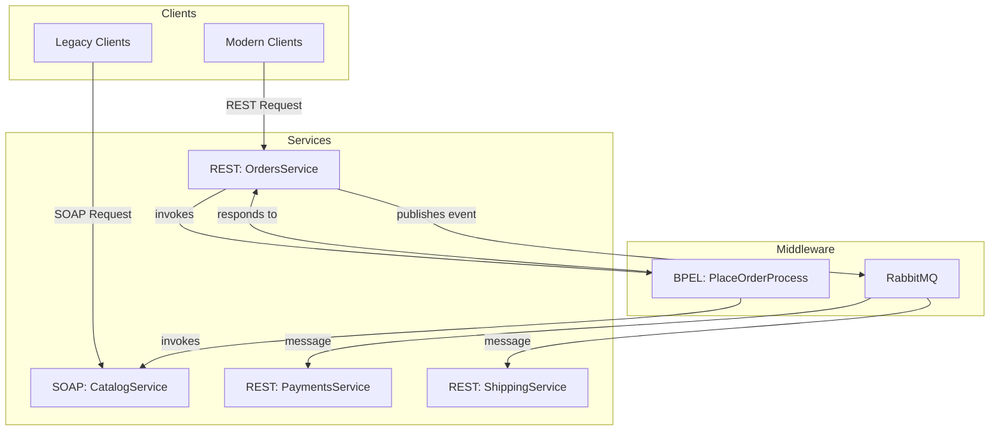

# GlobalBooks Inc. SOA Design Document

## 1. Introduction

### 1.1. Purpose
This document provides a comprehensive overview of the Service-Oriented Architecture (SOA) for GlobalBooks Inc. It details the migration from a legacy monolithic system to a hybrid SOA model, combining modern RESTful microservices with traditional SOAP-based services to support both new and existing partners.

### 1.2. Background
The existing order-processing system at GlobalBooks Inc. is a monolithic application that has become difficult to scale, maintain, and update. To improve agility, scalability, and enable modern application development, a decision was made to migrate to a service-oriented architecture.

### 1.3. Objectives
- **Decouple System Components:** Break down the monolith into independent, reusable services.
- **Support Legacy and Modern Clients:** Maintain compatibility with existing partners using SOAP while offering RESTful services for new applications.
- **Improve Scalability and Resilience:** Enable individual services to be scaled independently and build a more fault-tolerant system.
- **Enable Agility:** Accelerate development cycles by allowing teams to work on different services in parallel.
- **Future-Proof the Architecture:** Design a system that is ready for future migration to the cloud.

## 2. SOA Design Principles

The architecture is founded on the following core SOA principles:

- **Loose Coupling:** Services are designed to be independent, communicating through well-defined interfaces (WSDL for SOAP, JSON for REST) and asynchronous messaging (RabbitMQ). This minimizes dependencies and allows services to evolve independently.
- **Service Autonomy:** Each service manages its own data and business logic. For example, the `OrdersService` is responsible for the `orders` database and all business rules related to order management.
- **Service Reusability:** Services are built to be reusable across different business processes. The `CatalogService`, for instance, can be used by the internal order process as well as by external partner systems.
- **Service Composability:** Services can be combined to create more complex, composite services or business processes. The `PlaceOrder` process is a prime example, orchestrating calls to multiple services to fulfill a larger business function.

## 3. Service Decomposition

The monolithic system is decomposed into the following services:

- **CatalogService (SOAP):** A traditional SOAP web service that exposes book catalog information. This service is designed for legacy partners who have existing SOAP-based integrations. It communicates synchronously via WSDL-defined operations.
- **OrdersService (REST):** A modern RESTful microservice for managing all aspects of customer orders. It provides endpoints for creating, retrieving, and updating orders, communicating via JSON over HTTP.
- **PaymentsService (REST):** A RESTful microservice responsible for processing payments. It operates asynchronously, consuming messages from a queue to process payments for newly created orders.
- **ShippingService (REST):** A RESTful microservice that handles the shipping and logistics process. Like the `PaymentsService`, it works asynchronously, reacting to events to initiate the shipping process.

## 4. Service Registry and Discovery

A UDDI (Universal Description, Discovery, and Integration) registry is used for service discovery. The `governance/uddi/registry-entries.xml` file defines the metadata for all services in the system, including:
- **Business Entity:** `GlobalBooks Inc.`
- **Service Definitions:** `CatalogService`, `OrdersService`, `PaymentsService`, `ShippingService`.
- **Access Points:** The endpoint URLs for each service, specifying whether it's a WSDL endpoint or a REST API.

This allows consumers to programmatically discover available services and their capabilities.

## 5. Orchestration: The `PlaceOrder` Process

A central business process, `PlaceOrder`, is orchestrated using a BPEL (Business Process Execution Language) engine (Apache ODE). This process coordinates the interaction between the various services to fulfill an order.

### System Integration Diagram

### Workflow:
1. A client initiates an order through the `OrdersService`.
2. The `OrdersService` invokes the `PlaceOrderProcess` in the BPEL engine.
3. The BPEL process first calls the SOAP `CatalogService` to retrieve book details and validate the ISBN.
4. It then calls back to the `OrdersService` to finalize order creation.
5. Upon successful order creation, the `OrdersService` publishes an `order.created` event to a topic exchange in RabbitMQ.
6. The `PaymentsService` and `ShippingService`, subscribed to this topic, consume the event and begin their respective asynchronous processes.

## 6. Integration via RabbitMQ

RabbitMQ serves as the message broker, enabling asynchronous, event-driven communication between microservices.

- **Exchanges and Queues:** A topic exchange named `orders` is defined. Two queues, `orders.payments` and `orders.shipping`, are bound to this exchange. This allows the `OrdersService` to publish a single message that is delivered to both the payments and shipping queues.
- **Error Handling:** Dead-letter queues (DLQs) are configured for message durability. If a service fails to process a message after a certain number of retries, the message is moved to a DLQ. This prevents message loss and allows for later inspection and manual intervention.
- **Quality of Service (QoS):** Messages are marked as durable to ensure they survive a broker restart. Services use manual acknowledgment, ensuring that a message is not removed from the queue until it has been successfully processed.

## 7. Security Model

A dual security model is in place to accommodate the different service types.

- **SOAP Security (WS-Security):** The `CatalogService` is secured using WS-Security. The `security/ws-security/security-policy.xml` file defines a policy that requires a `UsernameToken` to be included in the SOAP header for authentication.
- **REST Security (OAuth2):** The REST microservices (`OrdersService`, `PaymentsService`, `ShippingService`) are secured using OAuth2. Clients must obtain an access token from an authorization server and include it in the `Authorization` header of their requests. Configuration details are stored in `security/oauth2/oauth2-config.yml`.

## 8. Governance Policy

- **Versioning:** REST APIs follow a URL path versioning strategy (e.g., `/v1/orders`). This ensures that new versions of an API can be introduced without breaking existing clients. The policy is documented in `governance/policies/versioning-policy.md`.
- **SLA Targets:** All services aim for 99.5% uptime and a response time under 200ms for the 95th percentile of requests. These targets are defined in `governance/policies/sla-targets.md`.
- **Deprecation:** When a new API version is released, the previous version will be supported for at least six months before being deprecated and eventually decommissioned, as outlined in `governance/policies/deprecation-plan.md`.

## 9. Cloud Deployment Approach

While the initial implementation is focused on a local setup, the architecture is designed for a future migration to AWS.

- **Platform:** The plan is to use a combination of AWS services:
    - **AWS Lambda:** For deploying the REST microservices as serverless functions.
    - **Amazon API Gateway:** To expose and manage the REST APIs.
    - **Amazon RDS for PostgreSQL:** To host the service databases.
    - **Amazon MQ for RabbitMQ:** For a managed message broker service.
    - **EC2/ECS:** For deploying the SOAP `CatalogService` if it cannot be containerized or migrated to a serverless paradigm.
- **Infrastructure as Code:** OpenTofu templates are provided in `local-setup/opentofu/` to automate the provisioning of the AWS infrastructure.
- **Monitoring and Health Checks:** AWS CloudWatch will be used for metrics, logging, and alarms. Each microservice will expose a health check endpoint (e.g., `/actuator/health`) that can be used by AWS services for monitoring.

## 10. Conclusion: Trade-offs and Future Improvements

### Trade-offs
- **Complexity:** The hybrid SOA is more complex to manage than a simple monolith or a pure microservices architecture. It requires expertise in both SOAP and REST, as well as orchestration and messaging technologies.
- **Orchestration vs. Choreography:** A BPEL-based orchestration model was chosen for centralized control over the `PlaceOrder` process. While this provides clear visibility and control, it can also lead to a less flexible system compared to a purely event-driven choreography approach. The current design is a mix, using orchestration for the initial synchronous part of the order and choreography for the asynchronous fulfillment.

### Future Improvements
- **Migrate SOAP Service:** A long-term goal could be to migrate the `CatalogService` to REST and decommission the SOAP interface once all legacy partners have updated their systems.
- **Service Mesh:** For a cloud-native deployment, introducing a service mesh like Istio or AWS App Mesh could provide more advanced capabilities for traffic management, observability, and security.
- **CI/CD Automation:** The existing GitHub Actions workflows can be expanded to fully automate the deployment of all services to the AWS environment.
